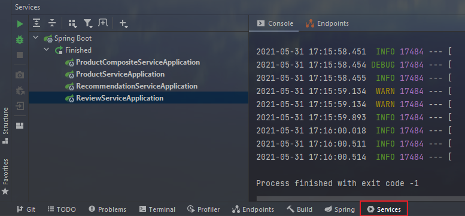

# Summary
This is a demo project in an effort to demonstrate the following basic ideas
of the **Microservice Architecture**:
1. Central API management
2. Central Error Handling 
3. Batch management of components
4. Aggregating results of multiple components using the **Edge Server** design pattern.
5. Testing microservices and API mocking.

## 1. Central API management
Relevant code can be found in the `api` module, `classpath:se.magnus.api`.

By defining our URL mappings in interfaces, we can have the corresponding
controllers implement these interfaces where they automatically get the
URL mappings of our API. For example, 
`se.magnus.microservices.core.product.ProductServiceImpl` is a `RestController`
that implements the `se.magnus.api.product.ProductService` interface.

## 2. Central Error Handling
API implementations use the exceptions in the `util` module to signal errors. 
They will be reported back to the REST client as HTTPS status codes 
indicating what went wrong.

Note that Spring itself returns the HTTP status code 400 ( BAD_REQUEST) 
when it detects an invalid request, for example, if the request contains 
a non-numeric `productId` (`productId` is specified as an integer in the 
API declaration).

## 3. Batch management of components

`Note:` From a DevOps (You build it, you run it) perspective, a multi-project setup might not be preferred. Instead, setting up a separate build pipeline for each microservice project would probably be preferred. However, for the purposes of demonstration, we will use the multi-project setup to make it easier to build and deploy the whole system landscape with a single command.

By using Gradle, we can add the following to `settings.gradle` of the project root:

```txt
include ':microservices:product-service'
include ':microservices:review-service'
include ':microservices:recommendation-service'
include ':microservices:product-composite-service'
include ':api'
include ':util'
```

Now we can build all the components using `./gradlew build`

If using the Idea IntelliJ IDE, we can also manage our services easily. For example, we can starting and terminating all our services at the same time:



Otherwise, we would need to do something like  `java -jar microservices/product-composite-service/build/libs/*.jar ` for all our services.

## 4. The *Edge Server* design pattern

The `product-composite-service` module demonstrate the idea of an **edge server**, a server that has its API exposed to outside requests. When clients make request to our edge server, our edge server acts as a **reverse proxy** that delegates the request to other known instances of our components. Then, the edge server is responsible for aggregating the results returned from the components and respond a carefully tailored "Summary" to the client. Note that many of the classes used by the `product-composite-service` module are under `se.magnus.api` for the purpose of centralized API management.

Also note that the current edge server is overly simple in a couple ways:

* It does not do load balancing among multiple instances of the same component.
* It does not hide the APIs of other components. So if somehow someone knows the URL of our non-edge components, they can access it freely. This is a serious security issue. This issue shall be resolved in later demo projects using **Spring Security** and **Spring Cloud**.
* It does not implement the **Service Discover** pattern.
* ... and many more

All the above problems shall be addressed in later projects.

## 5. Testing Microservices

Since we do not have much business logic at this time, we are not doing any unit test. Instead, we focus on testing the APIs that our microservices expose. We use the non-blocking reactive `WebTestClient` that came with Spring WebFlux.

These tests are located in the test folders of `se.magnus.microservices.core.**`

We can run all tests using `./gradlew test`

The most important one to look at is probably tests of `product-composite-service` where the API mocking is happening.


## 5.1. Adding Semi-automated Tests of the Entire Landscape

Being able to automatically test each microservice in isolation is, of course, very useful, but insufficient!

We need a way to automatically test all of our microservices to ensure that they deliver what we expect!

At this stage of learning, we can achieve it by writing test scripts using something like Bash. Because we want portability even for our test scripts, a great choice would by Python or Go. However, as we will learn in later projects, we will be fully automating tests using Docker.

# Note
It could be argued that a separate layer for the business logic should be 
added when implementing of the microservices. This should ensure that 
business logic is separated from the protocol-specific code, making it 
easier both to test and reuse. To avoid unnecessary complexity in the 
examples provided in this book, we have left out a separate layer for 
business logic, that is, the microservices implement their business 
logic directly in the `@RestController` components.

